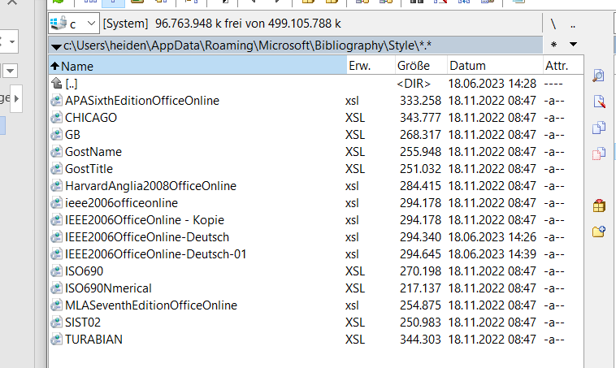

Bei dieser Methode soll beschrieben werden wie man mit IEEE richtig zitiert. Also Vorlage diente dieses Video:
https://www.youtube.com/watch?v=QUYloY8DDkI 

Im Ausschnitt (s. Abb. 1 unten) finden Sie das Verzeichnis mit meinen Daten zu der Datei. Zu beachten ist, dass die Ordner versteckt sind, also man muss das entsperren so dass man auch versteckte files sieht. Im Programm "Windows Commander" geht das und auch irgendwie in Windows direkt.  Anbei im Repository finden Sie den  den File, den man dann dort einfügen kann (IEEE2006...). Als Stil ist dann der bei Referenzen IEEE-Deutsch-01 auszwählen (muss in dem Verzeichnis liegen). 
Im Literaturverzeichnis ist dann z.T. noch ein p. das ist händisch zu korrigieren und auszubessern, das habe ich nicht automatisch geschafft. 
Wichtig ist dass alles mögliche „aktualisiert“ wird, und dann vielleicht noch händisch kontrollieren ob überall S. statt p. und pp. steht.

Abb. 1
